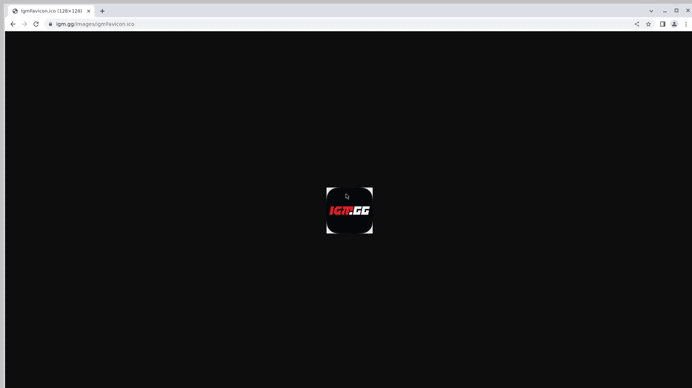

# Проект по автоматизации тестирования [IGM](https://igm.gg/)

<a href="https://igm.gg/"></a>

---
##  **Содержание:**

---

* [Технологии и инструменты](#технологии-и-инструменты)
* [Реализованные автоматизированные тесты](#реализованные-автоматизированные-тесты)
* [Запуск тестов - сборка в Jenkins](#запуск-тестов---сборка-в-jenkins)
* [Запуск тестов - локальный](#запуск-тестов---локальный)
* [Allure Report](#allure-report)
* [Allure TestOps](#allure-testops)
* [Jira](#jira)
* [Уведомление в Telegram о результатах тестов](#уведомление-в-telegram-о-результатах-тестов)
* [Пример видео выполнения теста на Selenoid](#пример-видео-выполнения-теста-на-selenoid)


## Технологии и инструменты:

---


<p align="center">  
<a href="https://www.jetbrains.com/idea/"></a>  
<a href="https://www.java.com/"></a>  
<a href="https://github.com/"></a>  
<a href="https://junit.org/junit5/"></a>  
<a href="https://gradle.org/"></a>  
<a href="https://selenide.org/"></a>  
<a href="https://aerokube.com/selenoid/"></a>
<a href="https://www.jenkins.io/"></a>
<a href="https://github.com/allure-framework/"></a>
</p>

---

## Реализованные автоматизированные тесты:

---
### Тесты на главную страницу
- *Переключение активной игры на следующую в слайдере TopGames посредством кнопки 'Следующий слайд'*
- *Переключение активной игры на предыдущую в слайдере TopGames посредством кнопки 'Предыдущий слайд'*
- *Переключение активной игры в слайдере TopGames посредством рандомного клика на видимую иконку*
### Тесты на компонент хэдер
- *Наличие всех элементов в хэдере*
### Тесты на поисковую строку
- *Поиск существующей игры с переходом на страницу игры*
- *Поиск несуществующей игры*
- *Сброс поискового запроса*
### Тесты на раздел 'Каталог'
- *Установка диапазона цены предлагаемых игр вручную*
- *Установка диапазона цены предлагаемых игр через радио баттоны*
- *Сброс только выбранного фильтра*
- *Сброс всех установленных фильтров вручную*
- *Сброс всех установленных фильтров через кнопку*
- *Добавить игру в раздел 'Желаемое', будучи авторизованным*
- *Добавить игру в раздел 'Желаемое', будучи не авторизованным*


---

## Запуск тестов - сборка в [Jenkins](https://jenkins.autotests.cloud/job/30-tinwhip-UI_FINAL_PROJECT/):

---
 
<p align="center">  
  
</p> 

***Для запуска тестов необходимо кликнуть 'Build with Parameters' и выбрать testType***

***Ключ testType позволяет запустить тесты с конкретным тэгом, либо выбор всех тестов для запуска:***
- *test - запускает все тесты*
- *header_test - запускает тесты на компонент хэдер*
- *main_test - запускает тесты на главную страницу*
- *catalog_test - запускает тесты на раздел 'Каталог'*
- *search_test - запускает тесты на поисковую строку*

## Запуск тестов - локальный
___
***Локальный запуск (вместо test можно выбрать другой ключ, см. пункт выше):***
- *-Denv=remote - запускает тесты удаленно посредством Selenoid*
- *-Denv=local - запускает тесты локально*

***Пример команды запуска:***
```  
gradle clean test -Denv=remote
```
*Также реализован запуск отдельного теста внутри IDE, посредством запуска через зелёный треугольник*

---
## [Allure Report](https://jenkins.autotests.cloud/job/30-tinwhip-UI_FINAL_PROJECT/allure/)

---

## Основная страница отчёта
***С инфомацией о количестве запущенных тестов, статусе прохождения и графика TREND, отображающего тенденцию прогона тестов***

<p align="center">  
  
</p>  

## Тест-кейсы.
***Содержат подробное описание шагов со скриншотами, видео и Page Source по каждому тесту***

<p align="center">  
  
</p> 


---
## [Allure TestOps](https://allure.autotests.cloud/project/4564/test-cases?treeId=0)

---

## Реализована интеграция с Allure TestOps

<p align="center">  
  
</p>  

---
## [Jira](https://jira.autotests.cloud/browse/HOMEWORK-1382)

---

## Реализована интеграция с Jira

<p align="center">  
  
</p>  

---

## Уведомление в Telegram о результатах тестов
____

<p align="center">  
  
</p> 

## Пример видео выполнения теста на Selenoid
____
<p align="center">
   
</p>